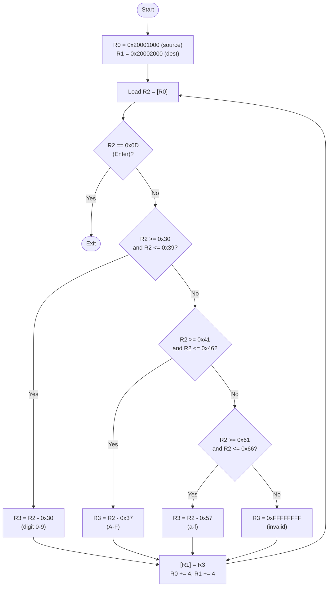
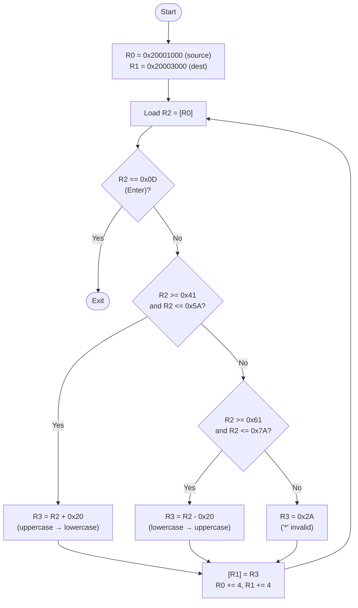

# Lab 1 Flowcharts

## Lab1a_L432KC.s — Hex ASCII to Value Converter

Converts hex ASCII characters (0–9, A–F, a–f) from source memory to 4-byte values in destination memory. Enter (0x0D) ends the loop.

---

## Lab1b_L432KC.s — Case Converter (Upper ↔ Lower)

Reads ASCII letters from source, converts uppercase→lowercase and lowercase→uppercase, writes to destination. Enter (0x0D) ends the loop. Non-letters become '*' (0x2A).

