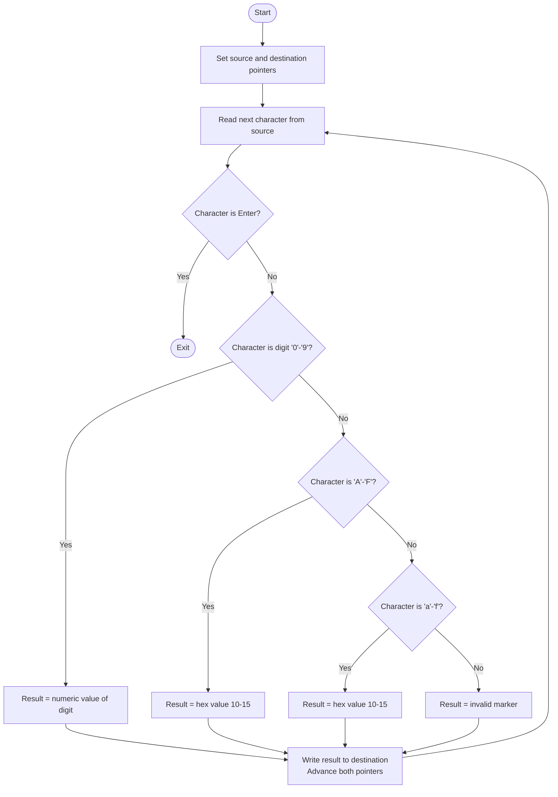
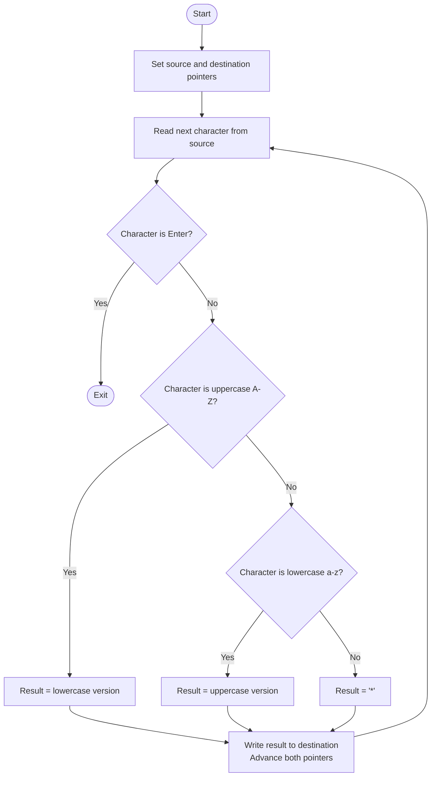

# Lab 1 Flowcharts

## Lab1a_L432KC.s — Hex ASCII to Value Converter

Converts hex characters (0–9, A–F, a–f) from source to numeric values in destination. Enter ends the loop.

---

## Lab1b_L432KC.s — Case Converter (Upper ↔ Lower)

Reads letters from source, converts uppercase→lowercase and lowercase→uppercase, writes to destination. Enter ends the loop. Non-letters become '*'.

