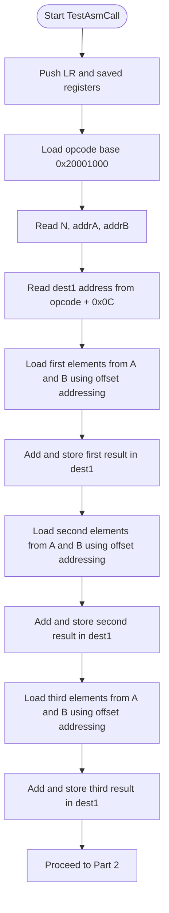
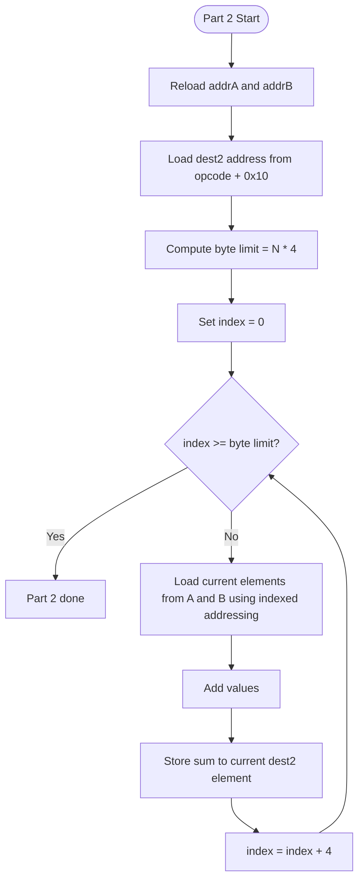
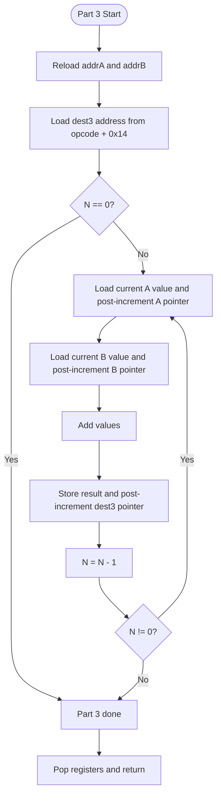
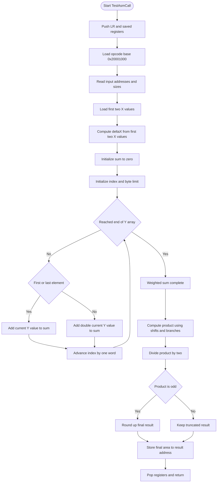

# Lab 2 Flow Charts

This file documents flow charts for the current implementations in:

- `Lab/Lab2/Provided/Lab2_L432KC/Lab2_L432KC/Lab2A/Lab2A_L432KC/Lab2a_L432KC.s`
- `Lab/Lab2/Provided/Lab2_L432KC/Lab2_L432KC/Lab2B/Lab2B_L432KC/Lab2b_L432KC.s`

## Lab2A Part A (Addressing Modes)

### Part 1: Register Indirect With Offset (First 3 Elements)

### Part 2: Indexed Register Indirect (Entire Array)

### Part 3: Post-Increment Register Indirect (Entire Array)

## Lab2B Part B (Trapezoidal Rule)

### Trapezoidal Area Calculation (No `MUL`)

## Notes for Report / Demo

- Lab2A Part 1 intentionally processes only the first 3 elements (per lab spec).
- Lab2A Part 2 uses an explicit index register (`r8`) and indexed addressing.
- Lab2A Part 3 uses post-increment addressing (`[reg], #4`) for all pointers.
- Lab2B avoids `MUL` and uses shifts/branch logic because `deltaX` is constrained to `1`, `2`, or `4`.
- Lab2B rounds only at the end (final result rounded up if fractional), matching the lab PDF requirement.
