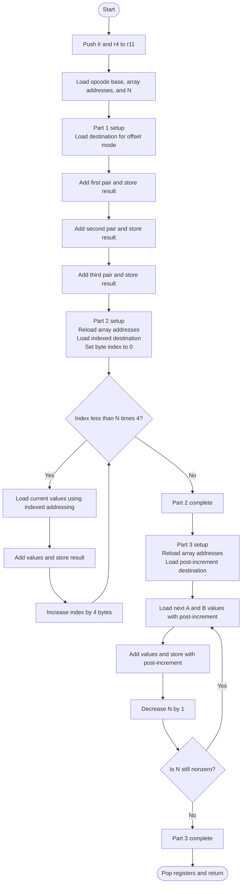

## Lab2a\_L432KC Flowchart

```mermaid
flowchart TD
    A([Start]) --> B[Push lr and r4 to r11]
    B --> C[Load opcode base, array addresses, and N]

    C --> D[Part 1 setup<br/>Load destination for offset mode]
    D --> D1[Add first pair and store result]
    D1 --> D2[Add second pair and store result]
    D2 --> D3[Add third pair and store result]

    D3 --> E[Part 2 setup<br/>Reload array addresses<br/>Load indexed destination<br/>Set byte index to 0]
    E --> F{Index less than N times 4?}
    F -->|Yes| G[Load current values using indexed addressing]
    G --> H[Add values and store result]
    H --> I[Increase index by 4 bytes]
    I --> F
    F -->|No| J[Part 2 complete]

    J --> K[Part 3 setup<br/>Reload array addresses<br/>Load post-increment destination]
    K --> L[Load next A and B values with post-increment]
    L --> M[Add values and store with post-increment]
    M --> N[Decrease N by 1]
    N --> O{Is N still nonzero?}
    O -->|Yes| L
    O -->|No| P[Part 3 complete]

    P --> Q([Pop registers and return])
```

