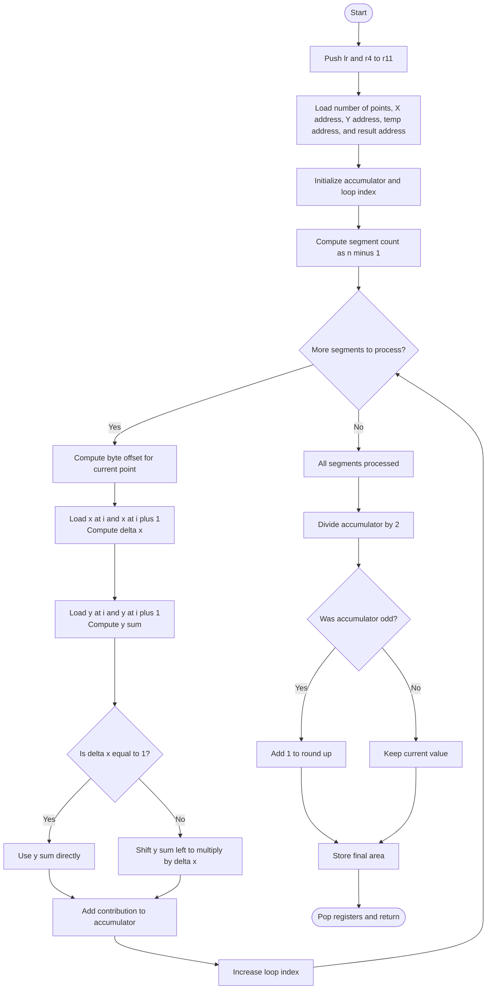

## Lab2b\_L432KC Flowchart

```mermaid
flowchart TD
    A([Start]) --> B[Push lr and r4 to r11]
    B --> C[Load number of points, X address, Y address, temp address, and result address]
    C --> D[Initialize accumulator and loop index]
    D --> E[Compute segment count as n minus 1]

    E --> F{More segments to process?}
    F -->|Yes| G[Compute byte offset for current point]
    G --> H[Load x at i and x at i plus 1<br/>Compute delta x]
    H --> I[Load y at i and y at i plus 1<br/>Compute y sum]
    I --> J{Is delta x equal to 1?}
    J -->|Yes| K[Use y sum directly]
    J -->|No| L[Shift y sum left to multiply by delta x]
    K --> M[Add contribution to accumulator]
    L --> M
    M --> N[Increase loop index]
    N --> F

    F -->|No| O[All segments processed]
    O --> P[Divide accumulator by 2]
    P --> Q{Was accumulator odd?}
    Q -->|Yes| R[Add 1 to round up]
    Q -->|No| S[Keep current value]
    R --> T[Store final area]
    S --> T
    T --> U([Pop registers and return])
```

