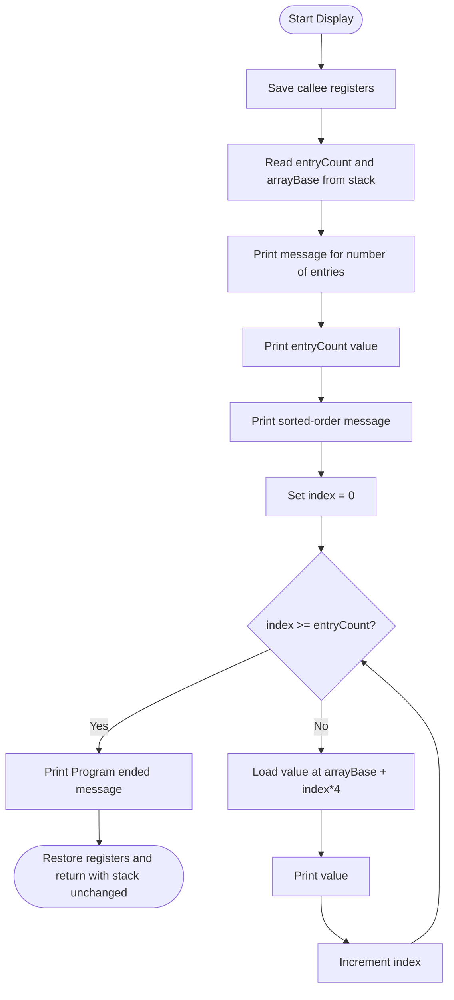

# Display Flowchart

```mermaid
flowchart TD
    start([Start Display]) --> saveRegs[Save callee registers]
    saveRegs --> readInputs[Read entryCount and arrayBase from stack]
    readInputs --> printCountMsg[Print message for number of entries]
    printCountMsg --> printCountVal[Print entryCount value]
    printCountVal --> printSortedMsg[Print sorted-order message]
    printSortedMsg --> initIndex[Set index = 0]
    initIndex --> donePrint{"index >= entryCount?"}
    donePrint -->|Yes| printEnd[Print Program ended message]
    printEnd --> restoreEnd([Restore registers and return with stack unchanged])
    donePrint -->|No| loadVal[Load value at arrayBase + index*4]
    loadVal --> printVal[Print value]
    printVal --> nextIndex[Increment index]
    nextIndex --> donePrint
```
