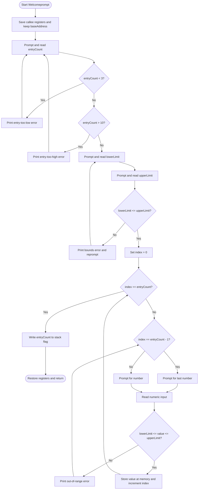

# WelcomePrompt Flowchart

```mermaid
flowchart TD
    start([Start Welcomeprompt]) --> saveRegs[Save callee registers and keep baseAddress]
    saveRegs --> promptEntry[Prompt and read entryCount]
    promptEntry --> entryLow{"entryCount < 3?"}
    entryLow -->|Yes| errLow[Print entry-too-low error] --> promptEntry
    entryLow -->|No| entryHigh{"entryCount > 10?"}
    entryHigh -->|Yes| errHigh[Print entry-too-high error] --> promptEntry
    entryHigh -->|No| promptLower[Prompt and read lowerLimit]
    promptLower --> promptUpper[Prompt and read upperLimit]
    promptUpper --> boundsOk{"lowerLimit <= upperLimit?"}
    boundsOk -->|No| errBounds[Print bounds error and reprompt] --> promptLower
    boundsOk -->|Yes| initIndex[Set index = 0]

    initIndex --> doneInput{"index == entryCount?"}
    doneInput -->|Yes| writeStack[Write entryCount to stack flag]
    writeStack --> endNode([Restore registers and return])
    doneInput -->|No| isLast{"index == entryCount - 1?"}
    isLast -->|Yes| promptLast[Prompt for last number]
    isLast -->|No| promptValue[Prompt for number]
    promptLast --> readValue[Read numeric input]
    promptValue --> readValue
    readValue --> inRange{"lowerLimit <= value <= upperLimit?"}
    inRange -->|No| errRange[Print out-of-range error] --> isLast
    inRange -->|Yes| storeValue[Store value at memory and increment index]
    storeValue --> doneInput
```
