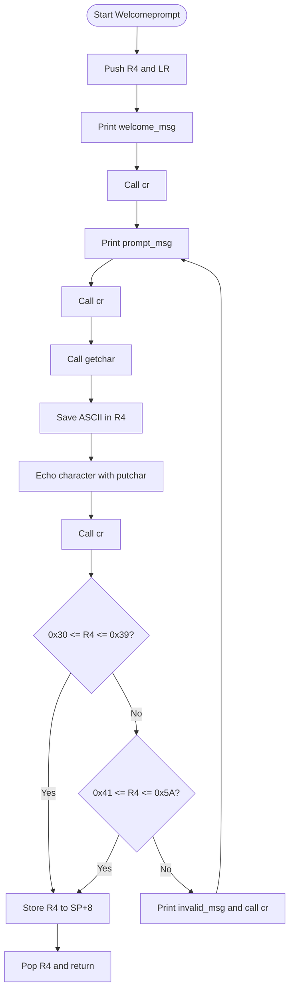

# WelcomePrompt

```mermaid
flowchart TD
    A([Start Welcomeprompt]) --> B[Push R4 and LR]
    B --> C[Print welcome_msg]
    C --> D[Call cr]
    D --> E[Print prompt_msg]
    E --> F[Call cr]
    F --> G[Call getchar]
    G --> H[Save ASCII in R4]
    H --> I[Echo character with putchar]
    I --> J[Call cr]
    J --> K{0x30 <= R4 <= 0x39?}
    K -- Yes --> N[Store R4 to SP+8]
    K -- No --> L{0x41 <= R4 <= 0x5A?}
    L -- Yes --> N
    L -- No --> M[Print invalid_msg and call cr]
    M --> E
    N --> O[Pop R4 and return]
```
