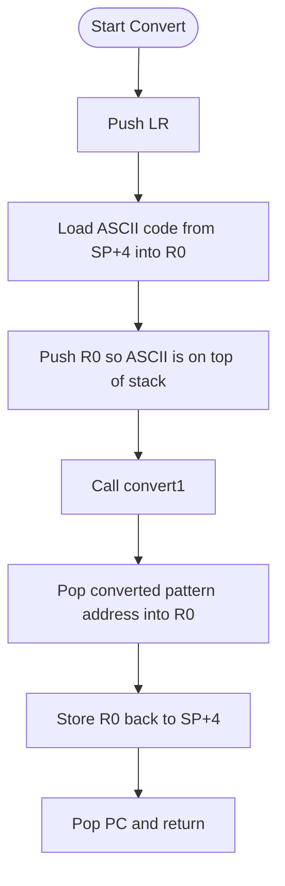

# Convert

```mermaid
flowchart TD
    A([Start Convert]) --> B[Push LR]
    B --> C[Load ASCII code from SP+4 into R0]
    C --> D[Push R0 so ASCII is on top of stack]
    D --> E[Call convert1]
    E --> F[Pop converted pattern address into R0]
    F --> G[Store R0 back to SP+4]
    G --> H[Pop PC and return]
```
