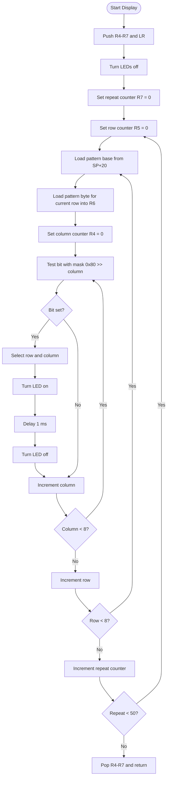

# Display

```mermaid
flowchart TD
    A([Start Display]) --> B[Push R4-R7 and LR]
    B --> C[Turn LEDs off]
    C --> D[Set repeat counter R7 = 0]
    D --> E[Set row counter R5 = 0]
    E --> F[Load pattern base from SP+20]
    F --> G[Load pattern byte for current row into R6]
    G --> H[Set column counter R4 = 0]
    H --> I[Test bit with mask 0x80 >> column]
    I --> J{Bit set?}
    J -- Yes --> K[Select row and column]
    K --> L[Turn LED on]
    L --> M[Delay 1 ms]
    M --> N[Turn LED off]
    N --> O[Increment column]
    J -- No --> O
    O --> P{Column < 8?}
    P -- Yes --> I
    P -- No --> Q[Increment row]
    Q --> R{Row < 8?}
    R -- Yes --> F
    R -- No --> S[Increment repeat counter]
    S --> T{Repeat < 50?}
    T -- Yes --> E
    T -- No --> U[Pop R4-R7 and return]
```
